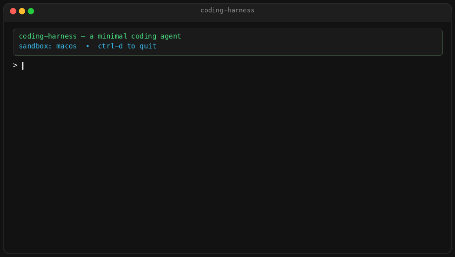

# coding-harness

A ~600-line Python runtime that turns an LLM into a coding agent. No frameworks.

The model only reads text and writes text. This repo is everything else: the loop, tools, permissions, OS sandbox, context management, skills, todos, sessions, and subagents.



<p align="center"><sub>Walkthrough of the loop from Part 1. Clone and run <code>coding-harness</code> for the live thing.</sub></p>

## Read the series

A 3-part walkthrough of this code, with the actual snippets:

1. **[The Core](https://ai-brewery.medium.com/harness-engineering-build-the-runtime-that-turns-an-llm-into-an-agent-part-1-3-eb5e2db28be1)** — agent loop, tools, permissions
2. **[The Safety Net](https://ai-brewery.medium.com/harness-engineering-build-the-runtime-that-turns-an-llm-into-an-agent-part-2-3-f81ea8101fd8)** — sandbox and context engineering
3. **[The Memory](https://ai-brewery.medium.com/harness-engineering-build-the-runtime-that-turns-an-llm-into-an-agent-part-3-3-d61f23b91998)** — skills, todos, sessions, subagents

## What's inside

| Module | Purpose |
|---|---|
| `agent.py` | The main loop: prompt → LLM → tool calls → repeat |
| `tools.py` | Tool definitions (bash, read/write files, str_replace) and defensive dispatch |
| `permissions.py` | Three-tier permission layer (allow / ask / deny) with glob pattern matching |
| `sandbox.py` | OS-level sandboxing — macOS Seatbelt or Linux Bubblewrap |
| `history.py` | Context management: cap, strip, and drop tool results to stay in window |
| `context.py` | Late injection of dynamic per-turn context (time, git state, file changes) |
| `compact.py` | LLM-driven compaction when the context window fills up |
| `skills.py` | Reusable instruction sets loaded on demand via `read_skill` |
| `todos.py` | Structured multi-step planning, re-injected every turn |
| `subagent.py` | Disposable exploration agents with their own context window |
| `session.py` | Append-only JSONL transcripts with rewind and resume |
| `llm.py` | OpenAI-compatible API wrapper |
| `prompt.py` | Input line with prompt_toolkit (history, key bindings) |
| `ui.py` | Rich console output (markdown, panels, spinners) |

## Quick start

```bash
git clone https://github.com/shrinidhi-mahishi/coding-harness.git
cd coding-harness
pip install -e .
```

Any OpenAI-compatible API works (OpenRouter, a local server, OpenAI itself). Create `~/.agents/env`:

```
BASE_URL=https://openrouter.ai/api/v1
API_KEY=sk-or-...
MODEL=deepseek/deepseek-v4-flash
```

Real environment variables win over that file. Then:

```bash
coding-harness
```

## How it works

1. **Agent loop** — a `while True` loop where the LLM calls tools, results are fed back, and it repeats until it has nothing left to do.

2. **Tools** — structured actions (bash, file I/O, str_replace, skills, todos, subagents) defined as JSON schemas and dispatched defensively. A bad tool call returns an error string instead of crashing the session.

3. **Permissions** — every bash command is split on `&&`, `||`, `;` and each part is matched against glob rules. The strictest verdict wins.

4. **Sandbox** — kernel-enforced isolation. On macOS, `sandbox-exec` with a Seatbelt profile. On Linux, Bubblewrap with `--unshare-net`.

5. **Context engineering** — tool results are capped (10k chars), stripped to stubs after the turn, and dropped oldest-first if the window is still too full.

6. **Compaction** — when prompt tokens exceed 85% of the context window, a second LLM call summarizes the conversation into a handoff note.

7. **Late injection** — dynamic context (timestamp, git branch, file changes, todos) is appended at the end of messages each turn to preserve prefix caching.

8. **Skills** — `SKILL.md` files with YAML frontmatter, discovered at startup, loaded on demand via `read_skill`.

9. **Subagents** — a `task` tool spins up a fresh agent loop in its own context window for exploration, returning only the findings.

10. **Sessions** — append-only JSONL logs with rewind markers, so you can resume any past conversation.

## License

MIT
